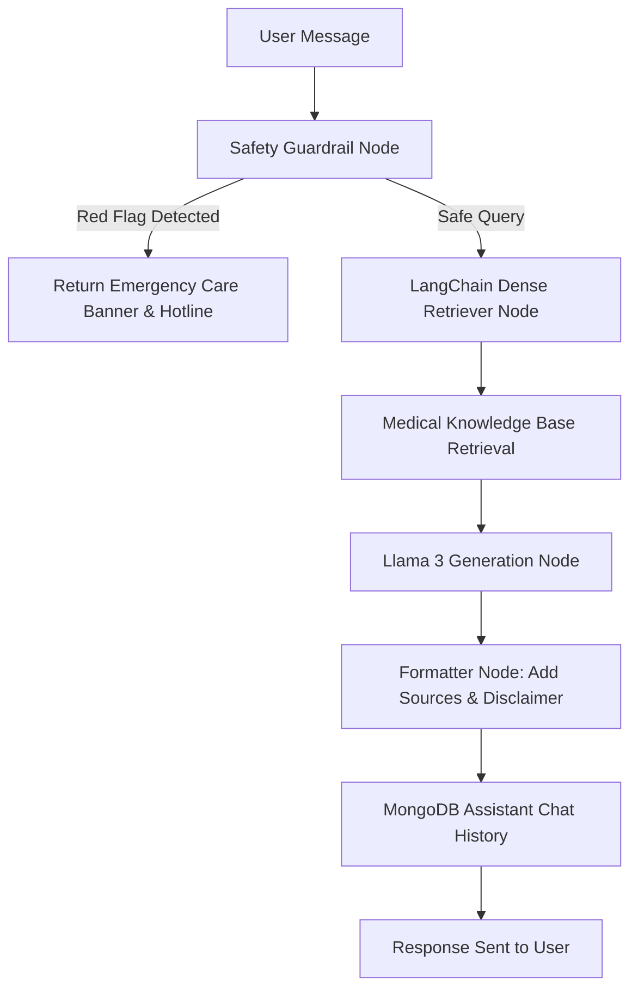

# 🌸 Saheli — Women's Health Companion & AI Health Platform

> **Saheli** *(meaning "trusted friend" in Hindi)* is a full-stack, privacy-first women’s health platform for menstrual health, PCOS management, fertility, pregnancy tracking, menopause guidance, and grounded AI-powered medical insights.

---

## 🌟 Overview

Saheli is designed to provide actionable, evidence-based, and empathetic health guidance for women at every stage of life. Powered by **React, TypeScript, Node.js, MongoDB Atlas**, and a **LangGraph + LangChain RAG AI Agent (Llama 3)**, Saheli bridges the gap between daily body logging, clinical medical literature, and patient-doctor communication.

---

## ✨ Core Features & Modules

### 🩸 1. Intelligent Cycle & Period Tracking
- **Cycle Stats & Analytics:** Calculates average cycle length, period duration, current cycle day, and predicts upcoming period & ovulation windows.
- **Visual Analytics:** Interactive charts powered by Recharts for flow intensity trends, phase timelines, and cycle regularity.
- **Log Flow & Notes:** Easily log daily flow levels (`light`, `medium`, `heavy`, `spotting`) and personal notes.

### 🌿 2. Comprehensive Symptom & Mood Logger
- **Multi-Category Tracking:** Track physical symptoms (cramps, bloating, acne, fatigue, headaches) and emotional states (calm, anxious, irritable, energetic, sad).
- **Severity Scoring:** Monitor symptom severity over time to identify recurring phase patterns (e.g., luteal phase mood dips or ovulatory pain).

### 🤖 3. Grounded AI Health Assistant (RAG + LangGraph)
- **Medically Grounded RAG Agent:** Built using **LangGraph** and **LangChain** workflow nodes, retrieving from a curated medical knowledge base.
- **Red-Flag Safety Screening:** Scans queries for urgent clinical symptoms (severe pain, excessive bleeding, high fever, pregnancy emergencies) and instantly presents emergency care warnings.
- **Citation & Transparency:** Provides clear source references and medical disclaimers with every answer.

### 🤰 4. Pregnancy Companion Mode
- **Weekly Guidance:** Tailored developmental insights from Week 4 through Week 40.
- **Trimester Milestones & Nutrition:** Trimester-by-trimester recommendations for folate, iron, hydration, and exercise.
- **Symptom & Kick Loggers:** Track pregnancy-specific symptoms and fetal movement patterns.

### 💊 5. Medication & Supplement Scheduler
- **Daily Reminders:** Track birth control pills, prenatal vitamins, PCOS supplements (Myo-Inositol, Vitamin D3), and prescription medications.
- **Dose & Schedule Tracking:** Active vs. paused medication states, custom dosage schedules, and logging history.

### 🩺 6. Doctor Summary Generator
- **Exportable Health Reports:** Generates a structured 30/60/90-day clinical report summarizing cycle statistics, top logged symptoms, medication compliance, and user notes.
- **Appointment Ready:** Designed for quick review with gynecologists, endocrinologists, or primary care providers.

### 🌸 7. Teen Mode
- **Friendly & Supportive Interface:** Simplified, educational explanations of puberty, first periods, hygiene, and body changes without clinical jargon.
- **Privacy-First:** Reassuring guidance tailored for younger users navigating early cycles.

### 🤝 8. Partner & Caregiver Data Sharing
- **Discreet Privacy Controls:** Granular toggle permissions to share cycle predictions, symptoms, or pregnancy updates with trusted partners, family, or healthcare providers.

### 💬 9. Anonymous Community Discussions
- **Safe Space Forums:** Discussion boards categorized by topics (*PCOS & Hormones*, *Pregnancy*, *Cycle Basics*, *Mental Wellbeing*).
- **Community Engagement:** Post questions, reply anonymously, and share lived experiences safely.

---

## 🧠 AI RAG Architecture (LangGraph + Llama 3)



- **Guardrail Node:** Checks against urgent clinical keyword patterns.
- **Retriever Node:** Performs semantic and keyword search across verified medical guidelines.
- **LLM Node:** Synthesizes actionable, empathetic, non-diagnostic guidance using Llama 3.
- **Persistence Node:** Saves chat logs to the MongoDB `assistant_chats` collection for cross-session continuity.

---

## 🛠️ Technology Stack

| Layer | Technologies Used |
| :--- | :--- |
| **Frontend** | React 18, TypeScript, Vite, Tailwind CSS, Framer Motion, Recharts, Lucide React, React Router v7 |
| **Backend** | Node.js (Native HTTP Server), ES Modules |
| **Database** | MongoDB Atlas (`saheli` database via MongoDB Node Driver v7) |
| **AI Framework** | LangGraph, LangChain, Llama 3 (Groq API / Local LLM) |
| **Deployment** | Vercel (Frontend SPA), Render (Backend API Service) |

---

## 📁 Directory Structure

```text
saaheeli/
├── server/
│   └── langgraph_agent.js      # LangGraph RAG Agent Workflow & Retriever
├── src/
│   ├── components/             # Reusable UI components & Layouts
│   │   ├── common/             # Buttons, Cards, Modals, Badges
│   │   └── layout/             # AppLayout, PublicLayout, Navigation
│   ├── context/                # AuthContext, ThemeContext, NotificationContext
│   ├── mock/                   # Fallback offline datasets & medical corpus
│   ├── pages/                  # 20+ feature pages (Tracker, Assistant, Meds, etc.)
│   ├── services/               # API service layer (api.ts, cycleService.ts, etc.)
│   ├── App.tsx                 # Client-side Router definitions
│   └── main.tsx                # Application Entry Point
├── .env                        # Local Environment Variables (Git-ignored)
├── .env.example                # Environment Variable Template
├── server.js                   # Node.js REST API Server connected to MongoDB Atlas
├── vercel.json                 # Vercel Single-Page Application rewrite config
├── vite.config.ts              # Vite dev server configuration & API proxy
└── package.json                # Dependencies and npm scripts
```

---

## 🔑 Environment Variables Setup

Create a `.env` file in the root directory (refer to `.env.example`):

```env
# Backend MongoDB Connection String
MONGODB_URI=mongodb+srv://<username>:<password>@cluster0.mongodb.net/saheli?retryWrites=true&w=majority

# Backend Server Port
PORT=5000

# Frontend API URL (Vite)
# Leave blank for local development (uses Vite dev proxy to http://localhost:5000)
# Set to your production backend URL on Vercel (e.g. https://saheli-backend.onrender.com)
VITE_API_URL=
```

---

## 🚀 Quickstart (Local Development)

1. **Clone the Repository & Install Dependencies:**
   ```bash
   git clone https://github.com/Anshhhitaaaa/saaheeli.git
   cd saaheeli
   npm install
   ```

2. **Start the Backend API Server:**
   ```bash
   npm run server
   ```
   *Output: `Successfully connected to MongoDB Atlas (saheli database)`*

3. **Start the Frontend Development Server:**
   In a second terminal window:
   ```bash
   npm run dev
   ```
   *Open `http://localhost:5173` in your browser.*

---

## 🌐 Production Deployment Guide

### 1. Backend Deployment (Render)
1. Create a **Web Service** on [Render](https://render.com/).
2. Connect the `Anshhhitaaaa/saaheeli` repository.
3. Configure build & start settings:
   - **Environment:** `Node`
   - **Build Command:** `npm install`
   - **Start Command:** `node server.js`
4. Add Environment Variables:
   - `MONGODB_URI`: Your MongoDB Atlas Connection String
   - `PORT`: `5000`
5. Copy your live Render URL (e.g., `https://saheli-backend.onrender.com`).

### 2. Frontend Deployment (Vercel)
1. Import the repository into [Vercel](https://vercel.com/).
2. Configure settings:
   - **Framework Preset:** `Vite`
   - **Build Command:** `npm run build`
   - **Output Directory:** `dist`
3. Add Environment Variable:
   - `VITE_API_URL`: `https://saheli-backend.onrender.com`
4. Click **Deploy**.

---

## 👩‍💻 Author & Contact

**Anshita Agrawal**
- 📧 **Email:** [agrawal.anshita07@gmail.com](mailto:agrawal.anshita07@gmail.com)
- 📞 **Phone:** +91 9315298434
- 🐙 **GitHub:** [@Anshhhitaaaa](https://github.com/Anshhhitaaaa)

---

## 🔒 Privacy & Medical Disclaimer

- **Privacy First:** Saheli does not sell personal health logs or tracking data. All share links are opt-in and configurable.
- **Medical Disclaimer:** Information provided by Saheli and its AI Assistant is for educational purposes only and is not a substitute for professional medical advice, diagnosis, or treatment.
