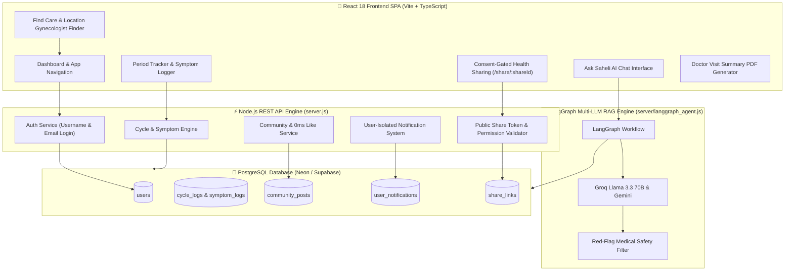

<div align="center">

# 🌸 Saheli (सहेली) — Women's Health Companion & AI Platform

<p align="center">
  
  
  
  
  
  
  
</p>

### *A privacy-first, consent-gated, full-stack ecosystem for menstrual tracking, PCOS management, fertility awareness, pregnancy companion guidance, location-based gynecologist discovery, and data-driven AI medical insights.*

---

[Key Features](#-key-features) • [System Architecture](#-system-architecture) • [Database Schema](#-database-schema) • [AI Engine](#-ai-engine) • [Quickstart](#-quickstart)

</div>

---

## 🌟 Why Saheli?

In Hindi, **Saheli (सहेली)** means *"trusted female friend"*. Traditional period trackers sell sensitive health data or treat women's health as a simple 28-day calendar. **Saheli** is designed differently:

- 🔒 **100% Consent-Gated Privacy**: You decide exactly who sees your health logs—with 1-click token revocation.
- 🤖 **Data-Driven AI Medical Companion**: Powered by **LangGraph & Multi-LLM RAG**, Saheli reads your actual cycle & symptom logs to answer *"When is my next period?"* or *"What phase am I in?"* with clinical accuracy.
- 🩺 **Instant Tele-Consultation & Gyno Finder**: Detects your location to surface nearby Gynecologists in **Delhi (NCR), Bengaluru, or Mumbai** with one-tap phone dialing.
- 📄 **1-Click Doctor Visit PDF Generator**: Compiles cycle stats, symptom histories, and custom physician notes into a printable medical summary.
- 💬 **Zero-Delay Community Forums**: Peer support forums with unique `@username` pseudonyms, 0ms optimistic likes, and activity notifications.

---

## 🎨 Design Aesthetics & Color System

Saheli features an organic, warm **Terra-Cotta & Sage** design system built with smooth Framer Motion micro-animations, glassmorphism card layouts, and crisp typography:

```text
  🌸 Warm Clay / Terra-Cotta   (#B84A34)  ➔ Primary Brand & Action Highlights
  🌿 Healing Sage Green        (#477459)  ➔ Health Insights & Consent Verification
  ☀️ Soft Sand Gold            (#F5EFE7)  ➔ Warm Background & Glassmorphic Surfaces
  🌙 Deep Slate Dark Mode      (#1F1914)  ➔ High-Contrast Night Mode Experience
```

---

## 🏗️ System Architecture & Data Flow



---

## ✨ Key Features & Capabilities

### 👤 1. Full-Stack Unique Username & Flexible Auth
- **Unique Handle Registration**: Enforces unique `@username` handle validation during signup (`/api/auth/signup`) and profile management (`/api/auth/update`).
- **Dual Login Flexibility**: Users can log in using either their unique `@username` or registered `email` address.
- **Live Database Sync**: Automatic profile sync on app mount (`/api/auth/me`) and manual **"Sync with Database"** control in Profile.

### 🩸 2. Intelligent Cycle & Period Tracking
- **Log Period Start Modal**: Quick date presets (*Today*, *Yesterday*, *2 days ago*, *3 days ago* or custom date picker), flow intensity (`spotting`, `light`, `medium`, `heavy`), and notes.
- **Live Calculations**: Instant recalculation of average cycle length, period duration, current cycle day, and next predicted period start date.
- **Visual Timelines**: Interactive flow timelines and phase breakdown cards (Menstrual, Follicular, Ovulatory, Luteal).

### 💬 3. Global Real-Time Community Forums & Instant Likes
- **Categorized Forums**: Filter discussions by `Periods`, `PCOS`, `Fertility`, `Pregnancy`, `Menopause`, and `General`.
- **Pseudonym Handles**: All posts and reply threads feature the user's real `@username`.
- **0ms Instant Optimistic Likes**: Clicking the Heart icon updates UI state instantly with **zero latency** while syncing with the PostgreSQL `community_posts` `likes` array in the background.
- **Activity Notifications**: Post authors are automatically notified when another user replies to or likes their discussion.

### 🏥 4. Location-Based Gynecologist Discovery & Tele-Consultation (`FindCare`)
- **HTML5 Geolocation Integration**: Uses `navigator.geolocation` to detect user coordinates and automatically resolve their city (`Delhi (NCR)`, `Bengaluru`, `Mumbai`).
- **City Selector**: Manual city picker bar for quick location toggling.
- **Real City Clinics**: Detailed local clinic datasets with addresses, distances, next availability, and phone numbers.
- **Instant "Talk to Gyno" Modal**: One-tap consultation modal displaying the on-duty senior gynecologist with direct phone dialing (`tel:`).

### 🤝 5. Consent-Gated Health Sharing & Public Reader (`Sharing`)
- **Granular Permissions**: Users can grant partners, family members, or doctors specific access to *Cycle History*, *Symptom & Mood Log*, *Pregnancy Updates*, or *Insights*.
- **Instant Access Revocation**: Toggle permissions or click **Revoke** anytime to set `active: false` in PostgreSQL.
- **Dynamic Share Links**: Generates environment-aware share links (`window.location.origin/share/:shareId`).
- **Public Read-Only Viewer (`/share/:shareId`)**: Dedicated read-only view for recipients with access protection and granted scope rendering.

### 🩺 6. Doctor-Visit Summary & PDF Report Generator
- **Live PostgreSQL Data Aggregation**: Compiles cycle logs, flow intensity, symptom history, and average cycle stats into a 1-page report.
- **Custom Doctor Notes**: Dedicated text box to type specific questions or symptoms for physician visits.
- **In-App Report Preview Modal**: Preview summary stats and notes inside the app before printing.
- **Print / Save as PDF**: Opens a print-friendly document ready for printing or downloading as a PDF.
- **Calendar Export (.ics)**: Downloads predicted period dates as an `.ics` file for Google Calendar or Apple Calendar.

### 🔔 7. User-Isolated Notifications System
- **Strict Database Scoping**: Every notification row in `user_notifications` is tied to the user's `email` (`WHERE email = $1`).
- **Independent Read States**: Reading or clearing notifications on User A's account never impacts User B's notification tray.
- **Automatic Signup Welcome Notifications**: Automatically generates personalized welcome & daily check-in notifications for new users upon registration.

---

## 🗄️ PostgreSQL Database Schema Architecture

Saheli's backend is powered by **9 production-grade relational tables** in PostgreSQL:

```sql
-- 1. Users & Authentication
CREATE TABLE users (
  id VARCHAR(64) PRIMARY KEY,
  name TEXT NOT NULL,
  username TEXT UNIQUE NOT NULL,
  email TEXT UNIQUE NOT NULL,
  password TEXT NOT NULL,
  focus TEXT DEFAULT 'general',
  pregnancy_mode BOOLEAN DEFAULT FALSE,
  pregnancy_week INTEGER,
  last_period_start TEXT,
  created_at TIMESTAMPTZ DEFAULT CURRENT_TIMESTAMP
);

-- 2. Period & Cycle Tracking Logs
CREATE TABLE cycle_logs (
  id SERIAL PRIMARY KEY,
  email TEXT NOT NULL,
  date TEXT NOT NULL,
  flow TEXT NOT NULL,
  note TEXT,
  updated_at TIMESTAMPTZ DEFAULT CURRENT_TIMESTAMP,
  UNIQUE(email, date)
);

-- 3. Daily Symptoms & Mood Log
CREATE TABLE symptom_logs (
  id SERIAL PRIMARY KEY,
  email TEXT NOT NULL,
  date TEXT NOT NULL,
  symptoms JSONB DEFAULT '[]',
  notes TEXT,
  mood TEXT,
  severity INTEGER DEFAULT 1,
  updated_at TIMESTAMPTZ DEFAULT CURRENT_TIMESTAMP,
  UNIQUE(email, date)
);

-- 4. Medication Prescriptions & Adherence History
CREATE TABLE medications (
  id VARCHAR(64) PRIMARY KEY,
  email TEXT NOT NULL,
  name TEXT NOT NULL,
  type TEXT,
  dose TEXT,
  schedule TEXT,
  active BOOLEAN DEFAULT TRUE,
  started_at TEXT,
  notes TEXT,
  taken_dates JSONB DEFAULT '[]'
);

-- 5. AI Assistant Conversation History
CREATE TABLE assistant_chats (
  id SERIAL PRIMARY KEY,
  email TEXT,
  conversation_id VARCHAR(64),
  user_message TEXT,
  bot_response TEXT,
  sources JSONB,
  safety_flag BOOLEAN DEFAULT FALSE,
  created_at TIMESTAMPTZ DEFAULT CURRENT_TIMESTAMP
);

-- 6. Community Forums & Nested Replies
CREATE TABLE community_posts (
  id VARCHAR(64) PRIMARY KEY,
  topic TEXT,
  author TEXT,
  title TEXT NOT NULL,
  body TEXT NOT NULL,
  replies JSONB DEFAULT '[]',
  likes JSONB DEFAULT '[]',
  created_at TIMESTAMPTZ DEFAULT CURRENT_TIMESTAMP
);

-- 7. Consent-Gated Sharing Links
CREATE TABLE share_links (
  id VARCHAR(64) PRIMARY KEY,
  email TEXT NOT NULL,
  name TEXT,
  relationship TEXT,
  permissions JSONB,
  active BOOLEAN DEFAULT TRUE,
  created_at TIMESTAMPTZ DEFAULT CURRENT_TIMESTAMP
);

-- 8. User-Isolated Notifications
CREATE TABLE user_notifications (
  id VARCHAR(64) PRIMARY KEY,
  email TEXT NOT NULL,
  category TEXT,
  title TEXT,
  message TEXT,
  discreet_message TEXT,
  read BOOLEAN DEFAULT FALSE,
  created_at TIMESTAMPTZ DEFAULT CURRENT_TIMESTAMP
);

-- 9. Notification Preferences
CREATE TABLE notification_preferences (
  email TEXT PRIMARY KEY,
  discreet_mode BOOLEAN DEFAULT TRUE,
  categories JSONB,
  updated_at TIMESTAMPTZ DEFAULT CURRENT_TIMESTAMP
);
```

---

## 🛠️ Technology Stack

| Layer | Technologies Used |
| :--- | :--- |
| **Frontend Framework** | React 18.3, TypeScript 5.5, Vite 5.4 |
| **UI Styling & Animation** | Tailwind CSS 3.4, Framer Motion 11, Recharts, Lucide React Icons |
| **Routing** | React Router v7 (SPA with Public, Auth, Shared, and App Layouts) |
| **Backend Runtime** | Node.js (Native HTTP REST Server), ES Modules |
| **Database** | PostgreSQL (`pg` pool, Neon Cloud / Supabase / Local PostgreSQL) |
| **AI RAG Pipeline** | LangGraph, LangChain, Groq Llama 3.3 70B, Google Gemini API |
| **Deployment Target** | Vercel (Frontend SPA), Render (Backend Service) |

---

## 📁 Repository Directory Structure

```text
saaheeli/
├── server/
│   └── langgraph_agent.js      # LangGraph Multi-LLM RAG Engine & Data-Driven Predictor
├── src/
│   ├── animations/
│   │   └── variants.ts         # Framer Motion animation variants (fadeUp, staggerContainer, easeOut)
│   ├── components/
│   │   ├── common/             # Button, Card, Modal, Input, Disclaimer, Logo, ThemeToggle, SeekCareBanner
│   │   ├── layout/             # AppLayout, PublicLayout, AuthLayout
│   │   ├── onboarding/         # OnboardingWalkthrough wizard
│   │   └── tracker/            # LogPeriodStartModal date picker
│   ├── context/
│   │   ├── AuthContext.tsx     # Full-stack auth, PostgreSQL profile auto-sync, username handles
│   │   ├── NotificationContext.tsx # User-isolated notification tray & unread badges
│   │   └── ThemeContext.tsx    # Light/Dark mode state manager
│   ├── pages/
│   │   ├── LandingPage.tsx     # Hero banner, feature showcases, preview cards
│   │   ├── DashboardPage.tsx   # Core hub, cycle status wheel, daily logger shortcuts
│   │   ├── TrackerPage.tsx     # Period log calendar, flow intensity logger, cycle stats
│   │   ├── SymptomsPage.tsx    # Symptom, mood, and severity logger
│   │   ├── AssistantPage.tsx   # "Ask Saheli" AI chat interface with RAG citations
│   │   ├── CommunityPage.tsx   # Topic forums, @username handles, 0ms optimistic likes, reply threads
│   │   ├── FindCarePage.tsx    # HTML5 Geolocation, city selector, Delhi clinics, "Talk to Gyno" modal
│   │   ├── SharingPage.tsx     # Consent-gated share link manager & revocation controls
│   │   ├── ShareViewPage.tsx   # Public read-only viewer page (/share/:shareId)
│   │   ├── DoctorSummaryPage.tsx # Printable PDF generator, custom doctor notes, .ics export
│   │   ├── MedsTrackerPage.tsx # Prescriptions manager, daily checklist, adherence calendar
│   │   ├── InsightsPage.tsx    # Recharts analytics for cycle length trends & mood charts
│   │   ├── PregnancyPage.tsx   # Week-by-week milestone tracker (Week 4-40) & kick counter
│   │   ├── TeenModePage.tsx    # First-period guides & teen cycle tracking
│   │   ├── ProfilePage.tsx     # Handle validation, focus preferences, manual DB sync
│   │   ├── LibraryPage.tsx & ArticlePage.tsx # Evidence-backed health library & reader
│   │   ├── LoginPage.tsx & SignupPage.tsx   # Auth pages supporting username or email login
│   │   └── AboutPage.tsx & ContactPage.tsx   # Mission statement & contact support
│   ├── services/
│   │   ├── api.ts              # Centralized HTTP fetch service for PostgreSQL APIs
│   │   ├── assistantService.ts # AI client service communicating with langgraph_agent.js
│   │   ├── cycleService.ts     # Cycle length & phase calculation engine
│   │   ├── exportService.ts    # Print-friendly PDF summary generator
│   │   └── calendarService.ts  # Standard .ics calendar event exporter
│   ├── App.tsx                 # Client Router (21 routes)
│   └── main.tsx                # App entry point
├── server.js                   # Node.js REST API Server connected to PostgreSQL (9 tables)
├── DESIGN.md                   # Visual design system & aesthetic guidelines
├── CONTENT-GUIDELINES.md       # Medical safety disclaimers & tone principles
├── vercel.json                 # Vercel SPA Routing Configuration
├── vite.config.ts              # Vite dev server configuration & API proxy
└── package.json                # Project dependencies & scripts
```

---

## ⚡ Quickstart & Local Setup

### 1. Clone & Install
```bash
git clone https://github.com/Anshhhitaaaa/saaheeli.git
cd saaheeli
npm install
```

### 2. Configure Environment Variables
Create a `.env` file in the root directory (see `.env.example`):
```env
DATABASE_URL=postgresql://<username>:<password>@<host>/<database>?sslmode=require
PORT=5000
VITE_API_URL=
```

### 3. Launch Backend API
```bash
npm run server
```
*Output: `Successfully connected to PostgreSQL database`*

### 4. Launch Frontend App
In a second terminal window:
```bash
npm run dev
```
*Open `http://localhost:5173` in your browser.*

---

<div align="center">

### 🌸 Designed & Developed with Care for Women Everywhere 🌸

**[Star this Repository ⭐](https://github.com/Anshhhitaaaa/saaheeli)**

</div>
