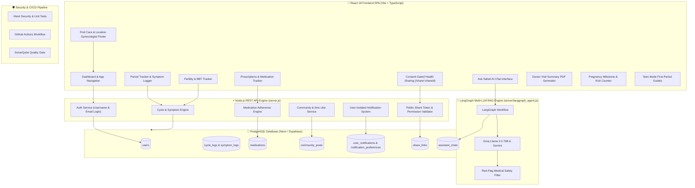

<div align="center">

# 🌸 Saheli (सहेली) — Women's Health Companion & Full-Stack AI Platform

<p align="center">
  
  
  
  
  
  
  
  
  
</p>

### *A privacy-first, consent-gated, full-stack ecosystem for menstrual cycle tracking, PCOS management, fertility awareness, pregnancy companion guidance, location-based gynecologist discovery, doctor-visit PDF report generation, and data-driven AI medical companion.*

---

[Why Saheli?](#-why-saheli) • [Key Features](#-key-features--modules) • [System Architecture](#%EF%B8%8F-system-architecture--data-flow) • [Database Schema](#-postgresql-database-schema-architecture) • [Security & Testing](#-security-architecture--automated-testing) • [Quickstart](#-quickstart--local-setup)

</div>

---

## 🌟 Why Saheli?

In Hindi, **Saheli (सहेली)** means *"trusted female friend"*. Traditional period trackers sell sensitive health data or treat women's health as a simple 28-day calendar. **Saheli** is designed differently:

- 🔒 **100% Consent-Gated Privacy**: You decide exactly who sees your health logs—with 1-click permission toggles and token revocation.
- 🤖 **Data-Driven AI Medical Companion**: Powered by **LangGraph & Multi-LLM RAG**, Saheli reads your actual cycle & symptom logs to answer *"When is my next period?"* or *"What phase am I in?"* with clinical accuracy.
- 🩺 **Instant Tele-Consultation & Gyno Finder**: Detects your location via HTML5 Geolocation to surface nearby Gynecologists in **Delhi (NCR), Bengaluru, or Mumbai** with one-tap phone dialing.
- 📄 **1-Click Doctor Visit PDF Generator**: Compiles cycle stats, symptom histories, and custom physician notes into a printable medical summary ready for appointments.
- 💊 **Prescriptions & Medication Tracker**: Daily medication adherence checklist, prescription manager, and dosage tracking.
- 💬 **Zero-Delay Community Forums**: Peer support forums with unique `@username` pseudonyms, 0ms optimistic likes, and activity notifications.
- 🧪 **Comprehensive Automated Testing & CI/CD**: Unit, component, and backend security testing with Vitest and GitHub Actions.

---

## 🎨 Design System & Visual Identity

Saheli features a warm, organic **Terra-Cotta & Sage** design system built with smooth Framer Motion micro-animations, glassmorphic card layouts, and dual-font typography:

```text
  🌸 Warm Clay / Terra-Cotta   (#B84A34)  ➔ Primary Brand & Action Highlights
  🌿 Healing Sage Green        (#477459)  ➔ Health Insights & Consent Verification
  ☀️ Soft Sand Gold            (#F5EFE7)  ➔ Warm Background & Glassmorphic Surfaces
  🌙 Deep Slate Dark Mode      (#1F1914)  ➔ High-Contrast Night Mode Experience
```

- **Typography**: `Fraunces` (warm, literary display serif for headings) and `Plus Jakarta Sans` (friendly, legible sans-serif for UI).
- **Motion Principles**: Animations feel like *breathing, not bouncing*—custom cubic-bezier easing (`cubic-bezier(0.4, 0, 0.2, 1)`), 150–500ms transitions, and global `prefers-reduced-motion` compliance.

---

## 🏗️ System Architecture & Data Flow



---

## ✨ Key Features & Modules

### 👤 1. Unique Handle Registration & Dual Auth
- **Unique Handle System**: Enforces unique `@username` validation during signup (`/api/auth/signup`) and profile management (`/api/auth/update`).
- **Dual Login Flexibility**: Log in using either your unique `@username` or registered `email`.
- **Live Database Sync**: Automatic profile sync on app mount (`/api/auth/me`) and manual **"Sync with Database"** control in Profile.

### 🩸 2. Intelligent Cycle & Period Tracking
- **Log Period Start Modal**: Quick date presets (*Today*, *Yesterday*, *2 days ago*, *3 days ago* or custom picker), flow intensity (`spotting`, `light`, `medium`, `heavy`), and notes.
- **Live Cycle Calculations**: Instant recalculation of average cycle length, period duration, current cycle day, and next predicted period start date.
- **Visual Timelines**: Interactive flow calendars and phase breakdown cards (*Menstrual*, *Follicular*, *Ovulatory*, *Luteal*).

### 🌡️ 3. Fertility & BBT Logger
- **Basal Body Temperature (BBT)**: Record daily morning body temperatures to track ovulation thermal shifts.
- **Cervical Mucus Tracking**: Log mucus consistency (`dry`, `sticky`, `creamy`, `egg_white`).
- **Ovulation Predictor Kit (OPK)**: Track strip test results (`positive`, `negative`) for fertility windows.

### 💊 4. Prescription & Medication Adherence Tracker
- **Prescription Management**: Add medications with dosage, schedule, and custom instructions.
- **Daily Checklist**: Interactive daily adherence checklist to log taken doses.
- **Calendar History**: Visual medication adherence history and active/inactive status toggling.

### 🤰 5. Pregnancy Companion & Kick Counter
- **Week-by-Week Guidance**: Fetal development milestones from Week 4 to Week 40.
- **Interactive Kick Counter**: Session timer and tap-counter to log fetal movements.
- **Trimester Insights**: Essential health checklists tailored for each trimester.

### 👧 6. Teen Mode First-Period Companion
- **First-Period Guides**: Age-appropriate educational content explaining cycle basics without overwhelming medical jargon.
- **Simplified Tracking**: Gentle flow logging and symptom tracking designed for younger users.

### 🤖 7. "Ask Saheli" LangGraph Multi-LLM RAG Engine
- **Data-Aware AI**: Answers questions using your actual logged cycle dates, symptoms, and health focus.
- **Red-Flag Medical Safety Layer**: Detects urgent symptoms (severe pain, heavy bleeding, fainting) and automatically wraps responses in a calm `SeekCareBanner`.
- **Source Citations**: Displays clickable evidence chips referencing reviewed medical articles.
- **Conversation Memory**: Persists chat history per user in PostgreSQL (`assistant_chats`).

### 💬 8. Global Real-Time Community Forums
- **Categorized Forums**: Discussions organized into `Periods`, `PCOS`, `Fertility`, `Pregnancy`, `Menopause`, and `General`.
- **Pseudonym Handles**: Posts and replies display the user's real `@username`.
- **0ms Instant Optimistic Likes**: Clicking the Heart icon updates UI state instantly while syncing with PostgreSQL in the background.
- **Activity Notifications**: Post authors automatically receive notifications when someone replies or likes their post.

### 🏥 9. Location-Based Gynecologist Discovery & Tele-Consultation
- **HTML5 Geolocation Integration**: Detects user coordinates to resolve their city (`Delhi (NCR)`, `Bengaluru`, `Mumbai`).
- **City Selector**: Quick manual dropdown to search clinics across supported cities.
- **Verified Clinics**: Directory with addresses, distances, next availability, and phone numbers.
- **"Talk to Gyno" Modal**: One-tap tele-consultation modal displaying on-duty gynecologists with direct phone dialing (`tel:`).

### 🤝 10. Consent-Gated Health Sharing & Public Reader
- **Granular Permissions**: Toggle individual access permissions for *Cycle History*, *Symptom & Mood Log*, *Pregnancy Updates*, or *Insights*.
- **1-Click Revocation**: Revoke access anytime to set `active: false` in PostgreSQL.
- **Dynamic Share Links**: Generates environment-aware share links (`/share/:shareId`).
- **Public Read-Only Viewer**: Dedicated recipient view displaying allowed sections based on granted permissions.

### 🩺 11. Doctor-Visit Summary & PDF Report Generator
- **Live Data Aggregation**: Compiles cycle logs, flow intensity, symptom history, and average stats into a single-page medical summary.
- **Custom Physician Notes**: Dedicated input area to write specific questions for doctor appointments.
- **Print / Save as PDF**: Opens a print-formatted window to print or export as PDF.
- **Calendar Export (.ics)**: Export predicted period dates to Google Calendar or Apple Calendar.

### 🔔 12. User-Isolated Notifications System
- **Strict Database Scoping**: Notifications are isolated per user email (`WHERE email = $1`).
- **Discreet Mode**: Toggle discreet notification titles for enhanced privacy.
- **Automatic Welcome Triggers**: Generates welcome notifications for new user registrations.

---

## 🗄️ PostgreSQL Database Schema Architecture

Saheli's backend relies on **9 production-grade relational tables** in PostgreSQL:

```sql
-- 1. Users & Authentication
CREATE TABLE users (
  id VARCHAR(64) PRIMARY KEY,
  name TEXT NOT NULL,
  username TEXT UNIQUE NOT NULL,
  email TEXT UNIQUE NOT NULL,
  password TEXT NOT NULL,
  focus TEXT DEFAULT 'general',
  pregnancy_mode BOOLEAN DEFAULT FALSE,
  pregnancy_week INTEGER,
  last_period_start TEXT,
  created_at TIMESTAMPTZ DEFAULT CURRENT_TIMESTAMP
);

-- 2. Period & Cycle Tracking Logs
CREATE TABLE cycle_logs (
  id SERIAL PRIMARY KEY,
  email TEXT NOT NULL,
  date TEXT NOT NULL,
  flow TEXT NOT NULL,
  note TEXT,
  updated_at TIMESTAMPTZ DEFAULT CURRENT_TIMESTAMP,
  UNIQUE(email, date)
);

-- 3. Daily Symptoms & Mood Log
CREATE TABLE symptom_logs (
  id SERIAL PRIMARY KEY,
  email TEXT NOT NULL,
  date TEXT NOT NULL,
  symptoms JSONB DEFAULT '[]',
  notes TEXT,
  mood TEXT,
  severity INTEGER DEFAULT 1,
  updated_at TIMESTAMPTZ DEFAULT CURRENT_TIMESTAMP,
  UNIQUE(email, date)
);

-- 4. Medication Prescriptions & Adherence History
CREATE TABLE medications (
  id VARCHAR(64) PRIMARY KEY,
  email TEXT NOT NULL,
  name TEXT NOT NULL,
  type TEXT,
  dose TEXT,
  schedule TEXT,
  active BOOLEAN DEFAULT TRUE,
  started_at TEXT,
  notes TEXT,
  taken_dates JSONB DEFAULT '[]'
);

-- 5. AI Assistant Conversation History
CREATE TABLE assistant_chats (
  id SERIAL PRIMARY KEY,
  email TEXT,
  conversation_id VARCHAR(64),
  user_message TEXT,
  bot_response TEXT,
  sources JSONB,
  safety_flag BOOLEAN DEFAULT FALSE,
  created_at TIMESTAMPTZ DEFAULT CURRENT_TIMESTAMP
);

-- 6. Community Forums & Nested Replies
CREATE TABLE community_posts (
  id VARCHAR(64) PRIMARY KEY,
  topic TEXT,
  author TEXT,
  title TEXT NOT NULL,
  body TEXT NOT NULL,
  replies JSONB DEFAULT '[]',
  likes JSONB DEFAULT '[]',
  created_at TIMESTAMPTZ DEFAULT CURRENT_TIMESTAMP
);

-- 7. Consent-Gated Sharing Links
CREATE TABLE share_links (
  id VARCHAR(64) PRIMARY KEY,
  email TEXT NOT NULL,
  name TEXT,
  relationship TEXT,
  permissions JSONB,
  active BOOLEAN DEFAULT TRUE,
  created_at TIMESTAMPTZ DEFAULT CURRENT_TIMESTAMP
);

-- 8. User-Isolated Notifications
CREATE TABLE user_notifications (
  id VARCHAR(64) PRIMARY KEY,
  email TEXT NOT NULL,
  category TEXT,
  title TEXT,
  message TEXT,
  discreet_message TEXT,
  read BOOLEAN DEFAULT FALSE,
  created_at TIMESTAMPTZ DEFAULT CURRENT_TIMESTAMP
);

-- 9. Notification Preferences
CREATE TABLE notification_preferences (
  email TEXT PRIMARY KEY,
  discreet_mode BOOLEAN DEFAULT TRUE,
  categories JSONB,
  updated_at TIMESTAMPTZ DEFAULT CURRENT_TIMESTAMP
);
```

---

## 🛡️ Security Architecture & Automated Testing

### Security Utilities (`src/utils/security.ts`)
- **`sanitizeHTML(str)`**: Escapes HTML characters (`&`, `<`, `>`, `"`, `'`, `/`) to prevent Cross-Site Scripting (XSS).
- **`stripDangerousTags(str)`**: Strips `<script>`, `<iframe>`, `<style>`, `javascript:`, and inline event handlers (`onerror`, `onload`).
- **`validatePasswordStrength(password)`**: Enforces password requirements (length >= 8, mixed-case, numbers, special characters) with score evaluation.
- **`isValidEmail(email)`** & **`isValidUsername(username)`**: Strict regex validators for input integrity.

### Automated Test Suites (`src/test/security/`)
- `auth.test.ts`: Validates username constraints, password hashing with BCrypt, and authentication flow.
- `sanitization.test.ts`: Verifies XSS sanitization and tag stripping routines.
- `component-security.test.tsx`: Tests UI input sanitization rendering in React components.
- `server-security.test.ts`: Validates REST API security headers, CORS boundaries, and SQL query parameterization.

### CI/CD Workflow (`.github/workflows/ci-cd.yml`)
- Runs **TypeScript Typecheck** (`npm run typecheck`).
- Executes **ESLint Code Check** (`npm run lint`).
- Runs **Vitest Unit & Security Tests with Code Coverage** (`npm run test:coverage`).
- Builds production distribution bundle (`npm run build`).
- Performs **SonarQube Static Code Analysis**.

---

## 🛠️ Technology Stack

| Layer | Technologies Used |
| :--- | :--- |
| **Frontend Framework** | React 18.3, TypeScript 5.5, Vite 5.4 |
| **UI Styling & Animation** | Tailwind CSS 3.4, Framer Motion 12, Recharts 3.9, Lucide React Icons |
| **Routing** | React Router v7 (Public, Auth, Authenticated SPA Layouts) |
| **Backend Runtime** | Node.js REST Server (`server.js`), ES Modules |
| **Database** | PostgreSQL (`pg` pool, Neon Cloud / Supabase / Local PostgreSQL) |
| **AI RAG Pipeline** | LangGraph, Groq Llama 3.3 70B, Google Gemini API |
| **Security & Utilities** | BCrypt.js, Custom XSS Sanitizers, Password Strength Evaluator |
| **Testing & Quality** | Vitest 3.0, Happy DOM, Testing Library, ESLint, SonarQube, GitHub Actions |
| **Internationalization** | Custom Lightweight i18n (`src/i18n`) for English & Hindi support |

---

## 📁 Repository Directory Structure

```text
saaheeli/
├── .github/
│   └── workflows/
│       └── ci-cd.yml           # GitHub Actions CI/CD Pipeline (Typecheck, Lint, Test, Build, SonarQube)
├── server/
│   └── langgraph_agent.js      # LangGraph Multi-LLM RAG Engine & Data-Driven Predictor
├── src/
│   ├── animations/
│   │   └── variants.ts         # Framer Motion animation variants (fadeUp, staggerContainer, easeOut)
│   ├── components/
│   │   ├── common/             # Button, Card, Modal, Input, Disclaimer, Logo, ThemeToggle, SeekCareBanner, Skeleton, AsyncState
│   │   ├── layout/             # AppLayout, PublicLayout, AuthLayout
│   │   ├── onboarding/         # OnboardingWalkthrough wizard
│   │   └── tracker/            # LogPeriodStartModal date picker
│   ├── context/
│   │   ├── AuthContext.tsx     # Full-stack auth, PostgreSQL profile auto-sync, username handles
│   │   ├── NotificationContext.tsx # User-isolated notification tray & unread badges
│   │   └── ThemeContext.tsx    # Light/Dark mode state manager
│   ├── hooks/
│   │   ├── useCountUp.ts       # Animated numerical count-up hook
│   │   └── useReducedMotionPref.ts # Accessibility prefers-reduced-motion hook
│   ├── i18n/
│   │   └── index.ts            # Lightweight i18n translations & hook (English / Hindi)
│   ├── mock/                   # Mock data fallbacks for cycle, symptoms, fertility, articles
│   ├── pages/
│   │   ├── LandingPage.tsx     # Hero banner, feature showcases, preview cards
│   │   ├── DashboardPage.tsx   # Core hub, cycle status wheel, daily logger shortcuts
│   │   ├── TrackerPage.tsx     # Period log calendar, flow intensity logger, cycle stats
│   │   ├── SymptomsPage.tsx    # Symptom, mood, and severity logger
│   │   ├── AssistantPage.tsx   # "Ask Saheli" AI chat interface with RAG citations
│   │   ├── CommunityPage.tsx   # Topic forums, @username handles, 0ms optimistic likes, reply threads
│   │   ├── FindCarePage.tsx    # HTML5 Geolocation, city selector, clinic finder, "Talk to Gyno" modal
      ├── SharingPage.tsx     # Consent-gated share link manager & revocation controls
│   │   ├── ShareViewPage.tsx   # Public read-only viewer page (/share/:shareId)
│   │   ├── DoctorSummaryPage.tsx # Printable PDF generator, custom doctor notes, .ics export
│   │   ├── MedsTrackerPage.tsx # Prescriptions manager, daily checklist, adherence calendar
│   │   ├── InsightsPage.tsx    # Recharts analytics for cycle length trends & mood charts
│   │   ├── PregnancyPage.tsx   # Week-by-week milestone tracker (Week 4-40) & kick counter
│   │   ├── TeenModePage.tsx    # First-period guides & teen cycle tracking
│   │   ├── ProfilePage.tsx     # Handle validation, focus preferences, manual DB sync
│   │   ├── LibraryPage.tsx & ArticlePage.tsx # Evidence-backed health library & reader
│   │   ├── LoginPage.tsx & SignupPage.tsx   # Auth pages supporting username or email login
│   │   └── AboutPage.tsx & ContactPage.tsx   # Mission statement & contact support
│   ├── services/
│   │   ├── api.ts              # Centralized HTTP fetch service for PostgreSQL REST APIs
│   │   ├── assistantService.ts # AI client service communicating with langgraph_agent.js
│   │   ├── cycleService.ts     # Cycle length & phase calculation engine
│   │   ├── exportService.ts    # Print-friendly PDF summary generator
│   │   └── calendarService.ts  # Standard .ics calendar event exporter
│   ├── test/                   # Automated Vitest security & component tests
│   │   ├── security/           # auth, sanitization, component, and server security test suites
│   │   └── setup.ts            # Vitest setup configuration
│   ├── utils/
│   │   └── security.ts         # XSS sanitization, password strength, and input validation utilities
│   ├── App.tsx                 # Client Router (21 SPA routes)
│   └── main.tsx                # App entry point
├── server.js                   # Node.js REST API Server connected to PostgreSQL (9 tables)
├── DESIGN.md                   # Visual design system & aesthetic guidelines
├── CONTENT-GUIDELINES.md       # Medical safety disclaimers & tone principles
├── vercel.json                 # Vercel SPA Routing Configuration
├── vite.config.ts              # Vite dev server configuration & API proxy
└── package.json                # Project dependencies & npm scripts
```

---

## ⚡ Quickstart & Local Setup

### 1. Clone & Install
```bash
git clone https://github.com/Anshhhitaaaa/saaheeli.git
cd saaheeli
npm install
```

### 2. Configure Environment Variables
Create a `.env` file in the root directory (see `.env.example`):
```env
DATABASE_URL=postgresql://<username>:<password>@<host>/<database>?sslmode=require
PORT=5000
VITE_API_URL=
GROQ_API_KEY=
GEMINI_API_KEY=
```

### 3. Launch Backend REST API Server
```bash
npm run server
```
*Output: `Successfully connected to PostgreSQL database`*

### 4. Launch Frontend App
In a second terminal:
```bash
npm run dev
```
*Open `http://localhost:5173` in your browser.*

### 5. Run Test Suite
```bash
# Run Security Tests
npm run test:security

# Run Vitest Suite with Coverage
npm run test:coverage

# Run TypeScript Typecheck
npm run typecheck
```

---

<div align="center">

### 🌸 Designed & Developed with Care for Women Everywhere 🌸

**[Star this Repository ⭐](https://github.com/Anshhhitaaaa/saaheeli)**

</div>
